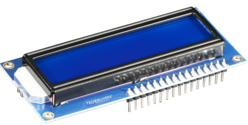

<center>


Created by Ouroboros Embedded Education.
</center>

## Versions Changelog

V1.0.0

- Initial Release

## Introduction

This is a simple library to work with the LCD Alphanumeric Display, encountered in many sizes and colors.

An applicable LCD Display can be seen below:

<center></center>

This lib aiming to provide this advantages:

- Allow use any amount of displays you want;
- Easy port to any chipsets, without any direct link with the microcontroller;
- Easy to configure;
- For noobies and professionais.

## Files

### lcdDisplay.c / lcdDisplay.h

Contains the Lcd logic functions and the Lcd Handler.

## Structure

The `lcd_t` handler contains all configurations and variables for Display Working. From version **v2.0.0**, the `lcd_t` instance must not be changed by the developer.

All initialization was made by the `lcd_params_t` struct, described below:

```C
typedef struct{
	/* (Mandatory) Function to control the GPIOs of the microcontroller. */
	lcd_gpio_fxn_t GpioFxn;

	/* (Optional) Function to set the backlight, from 0 to 100, you can use a simple gpio turn on/off
	 * or use a PWM to set a Brightness level
	 */
	lcd_backlight_fxn_t BacklightFxn;

	/* (Mandatory) Delay us wrapper function, must be implemented for correctly timing on startup 
	 * the request delay can reach 10ms, your function must support this timing.
	 */
	lcd_delay_us_fxn_t DelayUsFxn;

	/* (Mandatory) How amount Columns you Lcd have, if you display is a 
	 * 20x4, so, your columns will be 20
	 */
	uint32_t columns;

	/* (Mandatory) How amount Rows you Lcd have, if you display is a 
	 * 20x4, so, your rows will be 4
	 */
	uint32_t rows;

	/* (Mandatory) The program must know how you wired the Data pins of your LCD.
	 * LCD_INTERFACE_4BIT: if you connected D4~D7 pins
	 * LCD_INTERFACE_8BIT: if you connected D0~D7 pins
	 */
	lcd_interface_mode_e interface;

	/* (Mandatory) Tell the font sizing of the display.
	 * LCD_FONT_5X8: Most common
	 * LCD_FONT_5X10: A bigger version of the lcd display.
	 */
	lcd_font_type_e font;
}lcd_params_t;
```

Note that some functions are optional, other are mandatory, if any as an invalid value, the program will be asserted.


### Functions Prototypes

We have three functions prototypes to provide on the `lcd_params_t` function, let's see your parameters and how they work.

#### lcd_gpio_fxn_t GpioFxn 

This functions is used to control the LCD GPIOS. The function provide the pin to control and the signal, as described in the example below:

```C
void GpioFxn(lcd_pin_e pin, uint8_t state){
	switch (pin){
	case LCD_RS:
		// change the RS Pin output with 'state' value
		break;
	case LCD_RW:
		// change the RW Pin output with 'state' value
		// not used in most cases, the library doesn't support reading data from display
		break;
	case LCD_E:
		// change the E Pin output with 'state' value
		break;
	case LCD_D0:
		// change the D0 Pin output with 'state' value
		break;
	case LCD_D1:
		// change the D1 Pin output with 'state' value
		break;
	case LCD_D2:
		// change the D2 Pin output with 'state' value
		break;
	case LCD_D3:
		// change the D3 Pin output with 'state' value
		break;
	case LCD_D4:
		// change the D4 Pin output with 'state' value
		break;
	case LCD_D5:
		// change the D5 Pin output with 'state' value
		break;
	case LCD_D6:
		// change the D6 Pin output with 'state' value
		break;
	case LCD_D7:
		// change the D7 Pin output with 'state' value
		break;
	default:

		break;
	}
}
```

####  lcd_delay_us_fxn_t DelayUsFxn

Routine used to generate Microseconds delays, because the LCD Driver requires some delays between some commands.

```C
void DelayUs(uint32_t us){
	// call the delay functions from your MCU
	driver_delay_us(us);
}
```

In the STM32, we do not have a built-in delay microseconds, we can use a timer, following the example below, using the TIM1 with 1MHz frequency.

```C
void DelayUs(uint32_t us){
	uint32_t a;

	// Reset Timer counter to 0
	__HAL_TIM_SET_COUNTER(&htim1, 0);
	// Start the timer counter
	HAL_TIM_Base_Start(&htim1);

	do{
		// check if value of us is grater than timer counter limit
		if (us > 65534){
			a = 65534;
		}
		else{
			a = us;
		}
		// wait until timer reaches the 'a' value
		while (__HAL_TIM_GET_COUNTER(htim1) < a);
		// Reset Timer counter to 0
		__HAL_TIM_SET_COUNTER(&htim1, 0);
	}while (us > 0);

	// stop the timer
	HAL_TIM_Base_Stop(&htim1);
}
```

#### lcd_backlight_fxn_t BacklightFxn

This optional routine, is used to control the backlight of the LCD. This routine, to properly work, must have a hardware LED control, that can be done by using transistor or mosfets.

The routine will return 0 or 100 if use `lcd_backlight_set` to turn on or off the LCD or the value set on `lcd_backlight_set_bright` level parameter.

The routine can be implemented has showed below:

```C
void LcdBacklight(uint8_t value){
	// If using a GPIO as a digital Output
	if (value == 0){
		// Turn off the GPIO
		Gpio_SetOff();
	}
	else{
		// Turn on the GPIO
		Gpio_SetOn();
	}
	// If using a GPIO as a PWM output
	// Set PWM value
	PWM_SetValue(value);
}
```

## Functions

```C
/**
 * @brief Initialize the display.
 * 
 * @param lcd : pointer to the Lcd Handler
 * @param params: pointer to the Lcd Initialization parameters
 */
void lcd_init (lcd_t *lcd, lcd_params_t *params);  

/**
 * @brief Disables the cursor blink.
 * 
 * @param lcd : pointer to the Lcd Handler
 */
void lcd_blink_off(lcd_t *lcd);

/**
 * @brief Enables the cursor blink
 * 
 * @param lcd : pointer to the Lcd Handler
 */
void lcd_blink_on(lcd_t *lcd);

/**
 * @brief Disables the underline cursor
 * 
 * @param lcd : pointer to the Lcd Handler
 */
void lcd_cursor_off(lcd_t *lcd);

/**
 * @brief Enables the underline cursor
 * 
 * @param lcd : pointer to the Lcd Handler
 */
void lcd_cursor_on(lcd_t *lcd);

/**
 * @brief Turnoff the display without losing data
 * 
 * @param lcd : pointer to the Lcd Handler
 */
void lcd_display_off(lcd_t *lcd);

/**
 * @brief Turn on back the display
 * 
 * @param lcd : pointer to the Lcd Handler
 */
void lcd_display_on(lcd_t *lcd);

/**
 * @brief Sends a Command to the display;
 * 
 * @param lcd : pointer to the Lcd Handler
 * @param cmd : Command to issue to the Lcd, see lcd_cmd_e enum.
 */
void lcd_cmd (lcd_t *lcd, lcd_cmd_e cmd);  // send command to the lcd

/**
 * @brief Issue a raw byte data to the Lcd
 * 
 * @param lcd  : pointer to the Lcd Handler
 * @param data : the data byte
 */
void lcd_data (lcd_t *lcd, uint8_t data);

/**
 * @brief Change the cursor position on the Lcd pannel.
 * 
 * @param lcd : pointer to the Lcd Handler
 * @param row : desired row. The command will not be sent if row is greater than lcd->rows.
 * @param col : desired column. The command will not be sent if row is greater than lcd->columns.
 */
void lcd_put_pos(lcd_t *lcd, uint8_t row, uint8_t col);  

/**
 * @brief Send a char on the actual cursor position. Char can be a custom char, see the lcd_custom_char_e.
 * 
 * @param lcd : pointer to the Lcd Handler
 * @param data : the desired char
 */
void lcd_send_char (lcd_t *lcd, char data);  

/**
 * @brief Send a string, that starts on the actual cursor position. The library will 
 * automatically stops when reach the end of the display.
 * 
 * @param lcd : pointer to the Lcd Handler
 * @param str : array of characters containing the string
 */
void lcd_send_string (lcd_t *lcd, char *str);  // send string to the lcd

/**
 * @brief Send a char on the desired position
 * 
 * @param lcd : pointer to the Lcd Handler
 * @param data : the desired char
 * @param row : desired row. The command will not be sent if row is greater than lcd->rows.
 * @param col : desired column. The command will not be sent if row is greater than lcd->columns.
 */
void lcd_send_char_pos(lcd_t *lcd, char data, uint8_t row, uint8_t col);

/**
 * @brief Send a string, that starts on the provided row and column. The library will 
 * automatically stops when reach the end of the display.
 * 
 * @param lcd : pointer to the Lcd Handler
 * @param str : array of characters containing the string
 * @param row : desired row. The command will not be sent if row is greater than lcd->rows.
 * @param col : desired column. The command will not be sent if row is greater than lcd->columns.
 */
void lcd_send_string_pos (lcd_t *lcd, char *str, uint8_t row, uint8_t col);

/**
 * @brief Fills with blank only the desired row.
 * 
 * @param lcd : pointer to the Lcd Handler
 * @param row : the row to be cleared.
 */
void lcd_clear_row (lcd_t *lcd, uint8_t row);

/**
 * @brief Clears the entire display
 * 
 * @param lcd : pointer to the Lcd Handler
 */
void lcd_clear_all (lcd_t *lcd);

/**
 * @brief Creates a custom character
 * 
 * @param lcd : pointer to the Lcd Handler
 * @param custom : The custom position starting from LCD_CUSTOM_1 to LCD_CUSTOM_8
 * @param bitmap : The bitmap array
 */
void lcd_create_custom_char (lcd_t *lcd, lcd_custom_char_e custom, uint8_t *bitmap);

/**
 * @brief Sets the display backlight to on or off.
 * 
 * @param lcd : pointer to the Lcd Handler
 * @param state : LCD_BACKLIGHT_ON to turnon display or LCD_BACKLIGHT_OFF to turnoff (really?)
 */
void lcd_backlight_set (lcd_t *lcd, uint8_t state);

/**
 * @brief Sets the display brightness based on a percentage. To use this, the developer
 * must implements an PWM.
 * 
 * @param lcd : pointer to the Lcd Handler
 * @param level : You can set this value from 0 to 100, where 0 is the minumum brightness, and
 * 100, the maximum.
 */
void lcd_backlight_set_bright (lcd_t *lcd, uint8_t level);
```

## Quick Start Steps

See the `examples` folder to see how we can implement.
